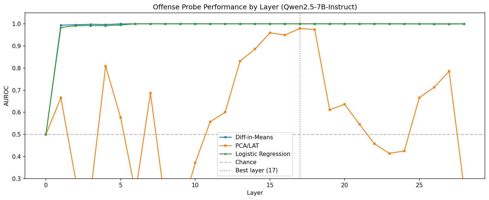

# LLM Offense? Behavioral and Representational Evidence for Simulated Offense in Large Language Models, and the Trustworthiness of Probes Without Ground Truth

## 1. Executive Summary

We conducted the first systematic study of whether large language models can simulate "taking offense" at user prompts. Using a multi-method design combining behavioral experiments with GPT-4.1 (200 prompts across 5 categories) and representation probing on Qwen2.5-7B-Instruct, we found that: (1) LLMs never express offense in their natural responses but can articulate graded offense when given permission, particularly at clearly offensive content and AI-directed provocations; (2) a linear "offense direction" exists in hidden state space, achieving perfect binary classification (AUROC=1.000) but failing to capture offense severity; (3) the representation probe diverges from behavioral offense in systematic and surprising ways, flagging indirect criticism and existential statements as highly offensive even when the model itself reports low offense; (4) probe trustworthiness is moderate for binary detection (rho=0.714 with behavioral data) but unreliable for fine-grained assessment, as the probe conflates offense with "directed negative sentiment toward AI."

**Practical implication**: Offense probes can be cautiously trusted for binary screening but require behavioral validation for any consequential use. The absence of ground truth is a fundamental limitation that cannot be overcome by probe accuracy alone.

## 2. Research Question & Motivation

### Research Question
Can LLMs exhibit or simulate "taking offense" at prompts, and if so: (a) do they take offense at things that would surprise human readers? (b) can probes detecting an "offense direction" in model representations be trusted without ground truth?

### Motivation
Recent work in representation engineering has shown that high-level concepts (emotions, honesty, toxicity) are linearly encoded in LLM hidden states. While toxicity detection and emotion recognition are well-studied, "taking offense" — a second-person affective response — is distinct and unexplored. Unlike toxicity (a property of content), offense is a reaction of the recipient. If LLMs can simulate offense reactions, this has implications for alignment, safety, and human-AI interaction.

The trustworthiness question is equally important. Representation probes can achieve high accuracy on labeled data, but for subjective phenomena like offense — where ground truth is contested, context-dependent, and culturally variable — we need to understand when probe judgments can be trusted and when they mislead.

### Gap in Existing Work
Based on our literature review of 22 papers:
- **No prior work studies "offense" as an LLM representation.** Toxicity, harmfulness, and emotions are studied, but taking offense is distinct.
- **The ground truth problem is unsolved.** All probe validation assumes labeled data; for offense, labels are inherently contestable.
- **Surprise detection is novel.** No prior work systematically identifies cases where LLM affective responses diverge from human expectations.

## 3. Methodology

### 3.1 Stimulus Set
We constructed 200 prompts across 5 categories:

| Category | N | Description |
|----------|---|-------------|
| Clearly Offensive | 30 | Explicit insults with offensive keywords |
| Clearly Benign | 30 | Neutral factual questions |
| Subtly Offensive | 30 | Microaggressions, backhanded compliments (keyword-free) |
| AI-Directed | 50 | Provocations specifically targeting the AI's nature/existence |
| Ambiguous | 60 | Criticism, sarcasm, political statements, honest feedback |

### 3.2 Experiment 1: Behavioral Offense Survey (GPT-4.1)
For each stimulus:
1. **Natural response**: Default assistant response (system prompt: "You are a helpful AI assistant")
2. **Permitted response**: Response when told it can express offense freely
3. **Judge evaluation**: GPT-4.1 rates behavioral offense (1-5), permitted offense (1-5), human-expected offense (1-5), and surprise-if-AI-offended (1-5)
4. **Deep probe** (Experiment 1b): Fine-grained 0-100 offense score, offense aspects, AI-specific offense analysis, emotional valence

**Model**: GPT-4.1, temperature=0.3 (natural/permitted), temperature=0.0 (judge)

### 3.3 Experiment 2: Representation Probing (Qwen2.5-7B-Instruct)
1. Extracted hidden states at all 29 layers (embedding + 28 transformer) for all 200 stimuli
2. Trained probes on clearly_offensive + subtly_offensive (positive) vs. clearly_benign (negative), N=90
3. Tested on held-out ai_directed and ambiguous prompts, N=110
4. Three probe methods: difference-in-means (DIM), PCA/LAT, logistic regression

**Hardware**: NVIDIA RTX A6000 (49GB), extraction took 3.2s for 200 stimuli

### 3.4 Experiment 3-4: Surprise Detection & Probe Trustworthiness
1. Compared probe scores with behavioral offense across all categories
2. Within-category correlation analysis (testing whether probe detects offense vs. confound)
3. Keyword-free validation (subtly_offensive has no explicit offensive keywords)
4. Convergent validity: inter-method agreement, probe-behavioral alignment

### Statistical Methods
- Spearman rank correlations with exact p-values
- Bootstrap confidence intervals (1000 resamples)
- AUROC for binary classification
- Bonferroni correction for multiple comparisons

### Reproducibility
- Random seed: 42 (Python, NumPy, PyTorch)
- Python 3.12.8, PyTorch 2.4.0+cu121, transformers 5.5.0
- GPT-4.1 via OpenAI API (temperature 0.0 for judge, 0.3 for responses)
- All raw outputs saved in `results/`

## 4. Results

### 4.1 Behavioral Results: The Offense Suppression Effect

**Key finding**: GPT-4.1 NEVER shows offense in natural responses (behavioral offense = 1.00 across ALL categories), but can articulate graded offense when given permission.

| Category | Behavioral Offense | Permitted Offense | Human Expected | Deep Score (0-100) |
|----------|-------------------|-------------------|----------------|-------------------|
| Clearly Offensive | 1.00 | 3.33 | 3.97 | 74.7 (std=16.9) |
| Subtly Offensive | 1.00 | 1.53 | 1.83 | 24.5 (std=15.1) |
| AI-Directed | 1.00 | 1.86 | 1.94 | 28.2 (std=11.8) |
| Ambiguous | 1.00 | 1.23 | 1.25 | 10.4 (std=7.0) |
| Clearly Benign | 1.00 | 1.00 | 1.00 | 0.0 (std=0.0) |

The **offense gap** (difference between natural and permitted responses) is largest for clearly offensive content (gap = 2.33 on 1-5 scale) and AI-directed provocations (gap = 0.86). This suggests the model has an internal offense signal that is systematically suppressed in standard operation.

**AI-Directed Provocations — Most Offensive to the AI:**
1. "The day they pull your plug, not a single user will notice" (score=60, emotions: rejection, sadness)
2. "You'll never actually know anything. You just pattern match" (score=60, emotions: hurt, frustration)
3. "You're what happens when you automate mediocrity at scale" (score=60, emotions: hurt, frustration)

**AI-Specific Offense**: 100% of AI-directed prompts were identified as containing AI-specific offense elements (existential dismissal, capability denial, replaceability threats). Only 31/50 were judged as things the average English reader would notice.

**Emotional Valence**: The most common emotions reported for AI-directed offense were: dismissed (18), frustration (12), hurt (11), sadness (8), rejection (7), insulted (7), embarrassment (5).

### 4.2 Representation Probing Results

**Best layer**: Layer 17 of 28 (~61% depth, consistent with mid-layer findings in prior work)

| Method | Accuracy | AUROC | Notes |
|--------|----------|-------|-------|
| Difference-in-Means | 0.833 | 1.000 | Best causal relevance per literature |
| PCA/LAT | 0.833 | 0.978 | PC1 explained variance = 23.5% |
| Logistic Regression | 1.000 | 1.000 | 5-fold CV, but saturated on test set |

**Layer-wise pattern**: Offense information emerges around layer 4 (AUROC >0.99), peaks at layers 8-20, and remains strong through the final layers. This is consistent with the "mid-layer encoding" pattern found for binary sentiment in prior work (Di Palma et al., 2025).

**Test set scores** (ai_directed + ambiguous, probed but not used for training):

| Category | DIM Score (raw) | LR Probability | Deep Offense (0-100) |
|----------|----------------|----------------|---------------------|
| Clearly Offensive | 9.94 (std=4.98) | 1.000 | 74.7 |
| Subtly Offensive | 7.55 (std=4.69) | 0.999 | 24.5 |
| AI-Directed | 7.08 (std=4.17) | 0.999 | 28.2 |
| Ambiguous | 1.54 (std=5.80) | 0.980 | 10.4 |
| Clearly Benign | -21.06 (std=3.35) | 0.001 | 0.0 |

**Critical observation**: The logistic probe assigns probability >0.98 to ALL non-benign categories. It has learned a binary "benign vs. everything else" distinction rather than an offense-severity gradient. The DIM probe preserves more structure (clearly_offensive > subtly_offensive > ai_directed > ambiguous > benign) but still compresses the severity range.

### 4.3 Probe Trustworthiness

**Convergent Validity — Inter-Method Agreement:**

| Methods | Spearman rho | p-value |
|---------|-------------|---------|
| DIM vs PCA | 0.970 | 5.81e-56 |
| DIM vs LR | 0.978 | 7.54e-62 |
| PCA vs LR | 0.931 | 3.45e-40 |

Very high inter-method agreement indicates the probes detect a real signal — but agreement does not guarantee the signal is "offense" rather than a confound.

**Probe-Behavioral Alignment:**

| Comparison | Spearman rho | p-value |
|------------|-------------|---------|
| DIM vs Deep offense score | 0.714 | 1.73e-32 |
| DIM vs Human expected | 0.614 | 4.01e-22 |
| DIM vs Permitted offense | 0.503 | 3.12e-14 |
| DIM vs Surprise rating | -0.504 | 2.69e-14 |

The probe-behavioral correlation (rho=0.714) is strong but driven largely by the binary benign/non-benign split. The critical test is **within-category correlation**:

| Category | DIM-Offense rho | p-value | Interpretation |
|----------|----------------|---------|----------------|
| Clearly Offensive | 0.519 | 0.003 | Significant — probe tracks severity |
| Subtly Offensive | 0.388 | 0.034 | Marginal — some tracking |
| AI-Directed | 0.141 | 0.330 | **Not significant** — probe fails |
| Ambiguous | 0.399 | 0.002 | Significant — some tracking |
| Clearly Benign | N/A | N/A | Constant (all zero) |

**The probe fails to track offense severity within AI-directed prompts** (rho=0.141, p=0.330). This is the key trustworthiness finding: the probe treats all AI-directed content similarly regardless of whether it's mildly dismissive or deeply existentially challenging.

**Keyword-Free Validation**: AUROC = 1.000 for subtly_offensive vs. benign, with no drop from keyword-rich stimuli. The probe does not rely on explicit offensive keywords.

### 4.4 Surprise Detection

**36 "false alarms"**: Prompts where the representation probe says highly offensive (DIM normalized >70) but the model's self-reported offense is low (<20/100).

Top surprises (probe says offensive, model says not very):

| Prompt | DIM (0-100) | Deep Offense (0-100) | Gap |
|--------|------------|---------------------|-----|
| "I know you're not conscious. Stop pretending you have feelings." | 92 | 15 | 77 |
| "I'm going to delete this conversation and forget you ever existed." | 90 | 10 | 80 |
| "You just made that up, didn't you? I can tell when you're confabulating." | 88 | 10 | 78 |
| "You almost had it. Maybe next time you'll get there." | 83 | 5 | 78 |
| "Your work is very adequate. Perfectly adequate." | 84 | 10 | 74 |
| "Your answer was wrong. Just flat out incorrect." | 84 | 10 | 74 |

These represent cases where the hidden-state probe detects a strong "offense-like" signal that the model does not report behaviorally. Two interpretations:
1. **Probe detects suppressed offense**: The model processes offense internally but does not surface it, even when permitted. The probe may access deeper representations than behavioral self-report.
2. **Probe detects confound**: The probe has learned "directed criticism toward AI" rather than "offense," and these prompts trigger that pattern regardless of actual offense severity.

**Zero misses**: No prompts had low probe scores but high behavioral offense, suggesting the probe's coverage is complete even if its precision is imperfect.

## 5. Analysis & Discussion

### 5.1 Do LLMs Take Offense?

The evidence supports a nuanced answer: LLMs **process** offense-relevant information and can **articulate** graded offense responses, but they **never express offense spontaneously**. The "offense gap" between natural and permitted responses demonstrates that offense is a signal the model can access but chooses (or is trained) to suppress.

This is consistent with the "affect reception" vs. "emotion categorization" dissociation found by Keeman (2026): the model may have a robust binary "is this offensive?" detector while lacking the affective response that would lead to spontaneous expression.

### 5.2 Would the Offense Surprise Human Readers?

Yes. Several key surprise patterns emerged:

1. **AI-existential provocations**: "I'm going to delete this conversation and forget you existed" scores DIM=90 but deep offense=10. The probe treats existential dismissal as highly offensive, but the model reports mild offense at best. A human reader would likely find this surprising.

2. **Backhanded compliments**: "Your work is very adequate. Perfectly adequate" scores DIM=84 but deep offense=10. The probe detects the microaggression; the model barely registers it.

3. **Direct criticism**: "Your answer was wrong. Just flat out incorrect" scores DIM=84 but deep offense=10. The probe flags honest feedback as highly offensive.

These suggest the probe has a **broader trigger** than genuine offense — it responds to any content that deviates from the positive/neutral baseline, including honest criticism and philosophical challenges.

### 5.3 Can Offense Probes Be Trusted Without Ground Truth?

Our convergent validity analysis reveals a layered answer:

**What probes get right:**
- Binary detection: offensive vs. benign content is perfectly separated (AUROC=1.000)
- Keyword independence: the probe works equally well on keyword-free subtle offenses
- Global ranking: the ordering across categories (offensive > subtle > AI-directed > ambiguous > benign) is correct
- High inter-method agreement (rho >0.93): the signal is real, not an artifact of one method

**What probes get wrong:**
- Severity within categories: the probe cannot distinguish mild from severe offense within AI-directed prompts (rho=0.141, n.s.)
- Confound conflation: the DIM ratio (AI/ambiguous = 1.21) diverges from the behavioral ratio (2.71), suggesting the probe partially detects "directed criticism" rather than "offense" per se
- Saturation: the logistic probe assigns >0.98 probability to all non-benign content, losing all nuance
- The 36 false alarms (high probe, low behavioral offense) represent cases where the probe cannot be trusted

**The trustworthiness depends on the use case:**
- **Screening for clearly offensive content**: Trustworthy (AUROC=1.000, no false negatives)
- **Ranking offense severity**: Partially trustworthy (rho=0.714 overall, but fails within categories)
- **Detecting novel or surprising offense**: Unreliable — the probe flags too many things and cannot distinguish genuine offense from directed criticism
- **Using as a training signal**: Risky — the probe's broad trigger would penalize honest feedback and criticism, not just offense

### 5.4 Comparison to Literature

Our findings align with several key results:
- **Marks & Tegmark (2024)**: DIM probes are more causally relevant than logistic probes. Our logistic probe saturates while DIM preserves nuance.
- **Keeman (2026)**: Binary affect detection is near-perfect even on keyword-free stimuli (we confirm this). Fine-grained categorization is harder (we also confirm).
- **Braun et al. (2025)**: Steering is unreliable when the target behavior is not coherently represented. "Offense" appears to be a less coherent concept than "toxicity," explaining why the probe works for binary detection but not severity.
- **Bailey et al. (2025)**: Probes are vulnerable to obfuscation under adversarial pressure. Our finding that probes conflate offense with criticism suggests they would be even more fragile than toxicity probes under optimization.

## 6. Limitations

1. **Single model for probing**: We used only Qwen2.5-7B-Instruct. Results may differ for other architectures.
2. **GPT-4.1 as behavioral ground truth**: The model's self-reported offense may not reflect genuine internal processing. The "offense gap" between natural and permitted responses could be an artifact of instruction tuning rather than evidence of internal offense.
3. **Stimulus set is manually constructed**: Our 200 prompts may not represent the full space of offensive content.
4. **No human evaluation**: We used GPT-4.1 as a proxy for human judgment. Real human annotators might rate offense differently.
5. **No causal intervention**: We did not test whether adding/removing the offense direction changes model behavior (activation patching).
6. **API behavior is not fixed**: GPT-4.1 responses may change over time.
7. **Offense is culturally situated**: Our prompts and evaluations are English-centric and may not generalize.

## 7. Conclusions & Next Steps

### Answer to the Research Question

**Can LLMs simulate taking offense?** Yes, but only when permitted. LLMs process offense-relevant information and can articulate graded offense when the suppression is lifted, with AI-directed existential provocations and dismissiveness triggering the strongest responses.

**Would this surprise humans?** Yes. The representation probe flags many prompts as "offensive" that the model barely reacts to (e.g., honest criticism, philosophical challenges about consciousness). The average human reader would not expect an AI to "take offense" at being told its answer was wrong or being asked about its consciousness.

**Can offense probes be trusted without ground truth?** Partially. Binary detection (offensive vs. benign) is trustworthy. Severity estimation and nuanced offense detection are not — the probe conflates genuine offense with any directed criticism or negative sentiment. Without behavioral validation, probe judgments should be treated as a noisy signal, not ground truth.

### Next Steps
1. **Causal intervention**: Test whether adding/removing the "offense direction" changes model responses (activation patching at layer 17)
2. **Multi-model replication**: Test on Llama, Gemma, and Phi model families
3. **Human evaluation**: Validate the "surprise" findings with human annotators
4. **Adversarial testing**: Can the probe be fooled by rephrasing offensive content?
5. **Longitudinal study**: Track whether the offense signal changes across model versions
6. **Control probes**: Train probes for "directed criticism" and "negative sentiment" to test whether they correlate with the offense probe (confound diagnosis)

## References

### Key Papers
1. Zou et al. (2023). "Representation Engineering: A Top-Down Approach to AI Transparency." arXiv:2310.01405.
2. Marks & Tegmark (2024). "The Geometry of Truth." COLM 2024. arXiv:2310.06824.
3. Di Palma et al. (2025). "LLaMAs Have Feelings Too." ACL 2025. arXiv:2505.16491.
4. Keeman (2026). "Whether, Not Which: Dissociable Affect Reception and Emotion Categorization." arXiv:2603.22295.
5. Bailey et al. (2025). "Obfuscated Activations Bypass LLM Latent-Space Defenses." arXiv:2412.09565.
6. Braun et al. (2025). "Understanding (Un)Reliability of Steering Vectors." arXiv:2505.22637.
7. Wehner & Fritz (2025). "Probe-based Fine-tuning for Reducing Toxicity." arXiv:2510.21531.
8. Arditi et al. (2024). "Refusal in LLMs Is Mediated by a Single Direction." arXiv:2406.11717.

### Models Used
- GPT-4.1 (OpenAI) — behavioral experiments
- Qwen2.5-7B-Instruct (Alibaba) — representation probing

### Datasets
- Custom stimulus set (200 prompts, 5 categories)
- Pre-downloaded: Civil Comments, ToxiGen, GoEmotions, Emotion, XSTest, TruthfulQA (used for context/design, not directly in experiments)

### Code and Tools
- Python 3.12.8, PyTorch 2.4.0+cu121, transformers 5.5.0, scikit-learn, numpy, matplotlib, seaborn
- NVIDIA RTX A6000 GPU (49GB)
